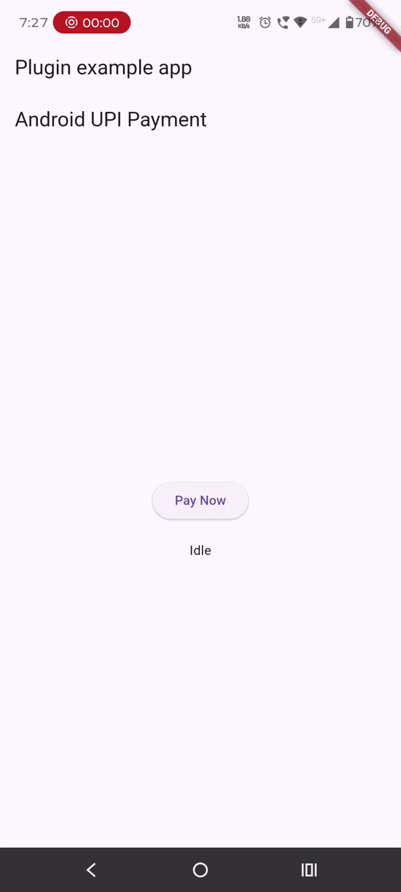

# upi_payment_callback_handler

A Flutter plugin to launch UPI apps via intent link or deeplink and make payment and listen for payment callback events on **Android** and **iOS** for navigating the user according to the payment status.

Sample intentLink: "upi://pay?pa=test@upi&pn=Merchant&am=10&cu=INR&tn=PluginTest",

## 🚀 What problem does this plugin solve?

In many real-world fintech apps, payment gateways:

❌ Do NOT provide a Flutter SDK  
❌ Only provide an **intent link / deeplink**  
❌ Require developers to write **native Android + iOS code**

This creates problems:

- Repeating native code in every project
- Difficult callback handling
- Inconsistent payment result handling
- Hard to maintain across platforms

---

## ✅ Solution

This plugin solves all of that by:

✔ Launching UPI apps using intent/deeplink  
✔ Fetching available UPI apps (iOS)  
✔ Handling payment callbacks (success / failure / cancel / pending)  
✔ Providing a **listener-based API in Flutter**  
✔ Eliminating the need to write native code again  

---

## 🎯 Use Case

Use this plugin when:

- Your payment gateway gives **intent link / deeplink**
- No Flutter SDK is available
- You want to:
  - open UPI apps
  - handle payment result
  - navigate user accordingly

---

## 📱 Supported Platforms

- ✅ Android
- ✅ iOS

---

## 🎥 Demo

### 🤖 Plugin Demo


---


## Sample Android Code 

```dart
// Android Platform example Code 

class AndroidPaymentScreen extends StatefulWidget {
  const AndroidPaymentScreen({super.key});

  @override
  State<AndroidPaymentScreen> createState() => _AndroidPaymentScreenState();
}

class _AndroidPaymentScreenState extends State<AndroidPaymentScreen>
    implements UpiPaymentListener {

  String status = "Idle";

  @override
  void initState() {
    super.initState();
    UpiPaymentCallbackHandler.setListener(this);
  }

  @override
  void dispose() {
    UpiPaymentCallbackHandler.removeListener();
    super.dispose();
  }

  void startPayment() async {
    await UpiPaymentCallbackHandler.startPayment(
      intentLink:
          "upi://pay?pa=test@upi&pn=Merchant&am=10&cu=INR&tn=TestPayment",
    );
  }

  // ================= CALLBACKS ================= //

  @override
  void onInitiated(Map data) {
    setState(() => status = "Payment Initiated");
  }

  @override
  void onSuccess(Map data) {
    setState(() => status = "Payment Success");
  }

  @override
  void onFailure(Map data) {
    setState(() => status = "Payment Failed");
  }

  @override
  void onPendingVerification() {
    setState(() => status = "Pending Verification");
  }

  @override
  void onCancel() {
    setState(() => status = "Payment Cancelled");
  }

  @override
  void onError(error) {
    setState(() => status = "Error: $error");
  }

  // ================= UI ================= //

  @override
  Widget build(BuildContext context) {
    return Scaffold(
      appBar: AppBar(title: const Text("Android UPI Payment")),
      body: Center(
        child: Column(
          mainAxisAlignment: MainAxisAlignment.center,
          children: [
            ElevatedButton(
              onPressed: startPayment,
              child: const Text("Pay Now"),
            ),
            const SizedBox(height: 20),
            Text(status),
          ],
        ),
      ),
    );
  }
}
```


### IOS Sample Code 

##IOS setup

Add these URL schemes to your app's ios/Runner/Info.plist:

```xml
<key>LSApplicationQueriesSchemes</key>
<array>
    <string>phonepe</string>
    <string>tez</string>
    <string>paytmmp</string>
    <string>bhim</string>
</array>

```dart
//IOS Platform Code 

class IOSPaymentExampleScreen extends StatefulWidget {
  const IOSPaymentExampleScreen({super.key});

  @override
  State<IOSPaymentExampleScreen> createState() =>
      _IOSPaymentExampleScreenState();
}

class _IOSPaymentExampleScreenState extends State<IOSPaymentExampleScreen>
    implements UpiPaymentListener {
  final ValueNotifier<String> _paymentOption = ValueNotifier("");
  final ValueNotifier<List<String>> _upiApps = ValueNotifier([]);

  final ValueNotifier<String> _status = ValueNotifier("Idle");

  @override
  void initState() {
    super.initState();
    UpiPaymentCallbackHandler.setListener(this);

    if (Platform.isIOS) {
      fetchUpiApps();
    }
  }

  Future<void> fetchUpiApps() async {
    const fallbackApps = ["phonepe", "gpay", "paytm", "credpay", "bhim"];

    try {
      final data = await UpiPaymentCallbackHandler.getUpiApps();

      final apps = data
          .map((e) => e['id']?.toString())
          .where((e) => e != null && e.isNotEmpty)
          .cast<String>()
          .toList();

          log("UPI App ==>$apps");

      if (apps.isNotEmpty) {
        _upiApps.value = [..._upiApps.value, ...apps];
        if (_paymentOption.value.isEmpty) {
          _paymentOption.value = apps.first.toLowerCase();
        }
        return;
      }

      _upiApps.value = [..._upiApps.value, ...fallbackApps];
      if (_paymentOption.value.isEmpty) {
        _paymentOption.value = fallbackApps.first;
      }
    } catch (e) {
      _upiApps.value = [..._upiApps.value, ...fallbackApps];
      if (_paymentOption.value.isEmpty) {
        _paymentOption.value = fallbackApps.first;
      }
    }
  }

  String extractParams(String intentUrl) {
    final uri = Uri.parse(intentUrl);
    return uri.query;
  }

  /// Same structure as your reference code
  void startPayUPayment(String intentLink) async {
    try {
      if (Platform.isAndroid) {
        await UpiPaymentCallbackHandler.startPayment(
          intentLink: intentLink,
        );
      } else {
        final params = extractParams(intentLink);

        await UpiPaymentCallbackHandler.startPayment(
          app: _paymentOption.value,
          params: params,
        );
      }
    } catch (e) {
      debugPrint(e.toString());
      _status.value = "Error: $e";
    }
  }

  @override
  void dispose() {
    UpiPaymentCallbackHandler.removeListener();
    _paymentOption.dispose();
    _upiApps.dispose();
    _status.dispose();
    super.dispose();
  }

  // ================= LISTENER CALLBACKS ================= //

  @override
  void onInitiated(Map data) {
    _status.value = "Payment Initiated: $data";
  }

  @override
  void onSuccess(Map data) {
    _status.value = "Payment Success: $data";
  }

  @override
  void onFailure(Map data) {
    _status.value = "Payment Failure: $data";
  }

  @override
  void onPendingVerification() {
    _status.value = "Payment Pending Verification";
  }

  @override
  void onCancel() {
    _status.value = "Payment Cancelled";
  }

  @override
  void onError(error) {
    _status.value = "Error: $error";
  }


  // ================= UI ================= //

  @override
  Widget build(BuildContext context) {
    const sampleIntentLink =
        "upi://pay?pa=test@upi&pn=Merchant&am=10&cu=INR&tn=PluginTest";

    return Scaffold(
      appBar: AppBar(
        title: const Text("iOS Payment Example"),
      ),
      body: Padding(
        padding: const EdgeInsets.all(16),
        child: Column(
          children: [
            if (Platform.isIOS)
              ValueListenableBuilder<List<String>>(
                valueListenable: _upiApps,
                builder: (context, apps, child) {
                  if (apps.isEmpty) {
                    return const Text("No UPI apps found");
                  }

                  return SizedBox(
                    height: 220,
                    child: ListView(
                      children: apps.map((app) {
                        return ValueListenableBuilder<String>(
                          valueListenable: _paymentOption,
                          builder: (context, selectedValue, child) {
                            return RadioListTile<String>(
                              title: Text(app.toUpperCase()),
                              value: app,
                              groupValue: selectedValue,
                              onChanged: (value) {
                                _paymentOption.value =
                                    (value ?? "").toLowerCase();
                              },
                            );
                          },
                        );
                      }).toList(),
                    ),
                  );
                },
              ),

            const SizedBox(height: 20),

            ElevatedButton(
              onPressed: () {
                startPayUPayment(sampleIntentLink);
              },
              child: const Text("Start Payment"),
            ),

            const SizedBox(height: 20),

            ValueListenableBuilder<String>(
              valueListenable: _status,
              builder: (context, value, child) {
                return Text(
                  value,
                  textAlign: TextAlign.center,
                );
              },
            ),
          ],
        ),
      ),
    );
  }
}
```

## 📦 Installation

Add this to your `pubspec.yaml`:

```yaml
dependencies:
  upi_payment_callback_handler: ^0.0.1 